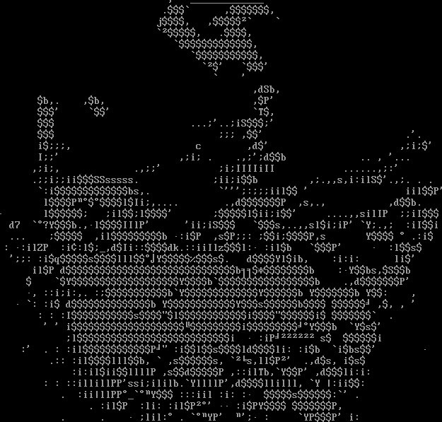
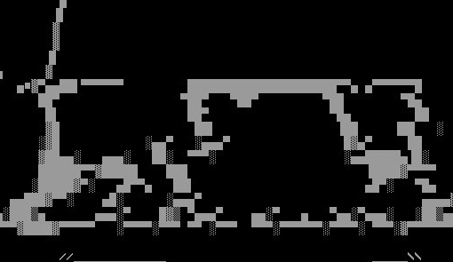
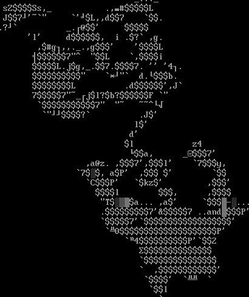
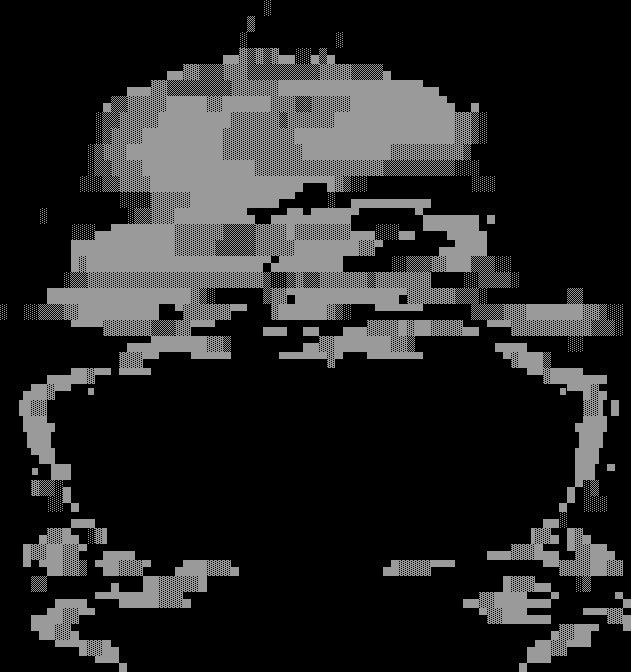
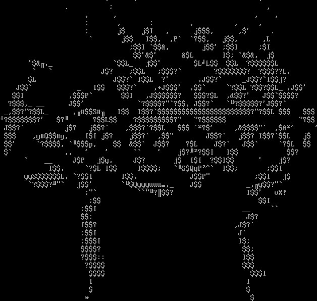

# Вот вам немножко абстрактного ASCIIарта...

Вот вам немножко "абстрактного ASCII-арта", некоторые картинки смутно напоминают сердечки и цветочки – с 8 марта! Я писал вчера, что компьютерам сложнее генерировать такие картинки, чем кажется. Типичный современный ответ на "компьютеру слабó" – нейронные сети. Вот эти картинки сгенерированы нейронной сетью, судя по всему, ее изначально тренировали точно передавать изображения, а потом стали извращать в сторону повышения криповости.

Полный набор и смутное указание авторства: http://rodarmor.com/artnet/

[artnet](http://rodarmor.com/artnet/)

    Date: 2017-03-08 12:43
    Likes: 51
    Comments: 0
    Reposts: 6
    Views: 2568
    Original URL: https://vk.com/wall-140963346_6

