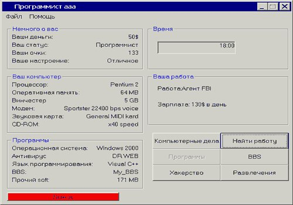

# Пока я безуспешно пытаюсь запустить...

Пока я безуспешно пытаюсь запустить лучшую из представительниц этого великого жанра, решил о нем самом написать. Это называется "Симулятор жизни", сами понимаете, нечто невероятно актуальное в России начала нулевых.

"Симулятор жизни" - так эти игры классифицировались на разного рода "файловых помойках", куда можно было залезть с родительской работы и скачать (на флешку или записав на CD-RW) кучу всего. Это были настоящие походы к старьевщику, самое близкое к scavenger hunt, что у меня было. Первым делом надо было скачать "менеджер закачек", который бы превратил неловкий и хрупкий процесс скачки во что-то хотя бы немного упорядоченное и страбильное, потом собрать все полезное (распаковщики архивов, просматривальщики картинок, изменяльщики настроек), и напоследок, внимательно читая описания игр, выбрать из них лучшие.

Игры, что водились на этих помойках, выглядели как на скриншоте (скриншот случайный, а мой любимый пример будет в другой раз). Искусство эпохи Windows, они - истина той самой поздней античности, по которой тоскует возрождение vaporwave. Их внешний вид был полностью собран из элементов, входящих в стандартную поставку программистских инструментов от Microsoft (лишь самые красивые и пафосные из них программировались в несвязанной с Microsoft среде со вполне античным названием Delphi). Эти элементы были по большей части элементами "форм", т.е., предназначались для получения от пользователя какой-либо информации, являлись электронным аналогом анкеты. Игры, сделанные на скорую руку из этих кусков бесконечной анкеты, практически все так или иначе описывали жизнь программиста, более-менее единственную непосредственно доступную их разработчикам реальность.

В те годы компьютеры обещали, в первую очередь, наконец преодолеть пространство. Поэтому вокруг них было так много чашек: всё на свете становилось или непосредственно здесь, или абсолютно недоступно. "Компьютерные дела", "Поиск работы" и "Развлечения", сведенные к клику, это не внутриигровая абстракция, а мечта и обещание интернета. Пространство казалось лишь тем, что отделяет нас от вещей, это видно во всех играх; но игры совсем без него оказываются невероятно одиноки, ведь невозможно разделять с кем-то пространство, которого нет. В этих играх нет друзей, врагов, напарников или соперников (кроме персонажей заголовков абстрактных вариантов "Развлечений", кнопок, надписанных "Свозить девушку на курорт (600$)" или "Выпить с друзьями (150$)"): у разработчиков этих игр было достаточно опыта дружбы, хотя бы по ICQ, но, видимо, даже общение на расстоянии предполагает опыт нахождения вместе, от которого нужно постоянно хотеть отказаться.

Без пространства остаются задавать координаты жизни лишь время и деньги, но простому перетеканию первого во вторые не хватает напряжения. Чтобы сделать все интереснее, англосаксонские игры выдумали параметр "Голод": именно голод гонит американского персонажа какой-нибудь roguelike вглубь подземелья, он должен найти еду в срок или умереть. В русской культуре "симуляторов жизни" этому параметру соответствует более актуальное для нас "Настроение", которое не требует даже особых поисков: просто игрок должен не забывать время от времени "Возить девушку на курорт (600$)", иначе его ждет автоматическое и необратимое самоубийство без записок и похорон. Я забывал всё время, проигрывал и очень злился.

    Date: 2017-03-16 02:30
    Likes: 35
    Comments: 3
    Reposts: 5
    Views: 1768
    Original URL: https://vk.com/wall-140963346_8

--------------------

  * Валя, это ж любимая моя игра!
    Author: Dasha Belkina, Date: 2017-03-29 18:25, Likes: 0

  * Я тоже играла )
    Author: Avrora Gesse, Date: 2017-04-08 19:41, Likes: 0

  * было дело, вирусы атаковали всё время(
    Author: Charles Manson, Date: 2017-11-28 12:17, Likes: 0

