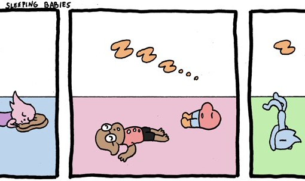
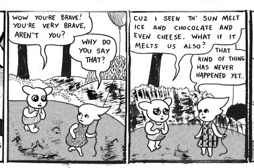
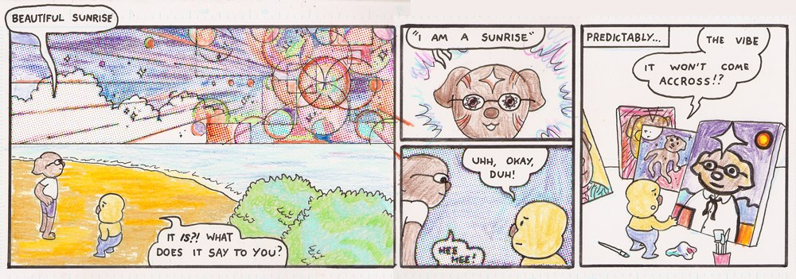
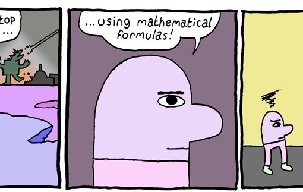

# Вебкомикс  класснейший компьютерный жанр...

Вебкомикс - класснейший компьютерный жанр, я полчаса думал, чем он от газетного отличается, не очень много придумал. Я думаю, главное отличие - в кнопке "Random". Она вообще всё меняет в практике чтения, попробуйте!

В любом случае, вот один из моих любимых вебкомиксов, Ebbits ( http://ebbits.net/ ). Он примерно настолько же милый (цветные карандаши и фломастеры!), насколько пытается быть умным. Эпизод про солнечные щупальца вообще как лекарство. В некотором смысле он как всё, чем пытается быть тумблер: очаровательный, инфантильный, знает много умных слов и часто говорит про тревогу.

К сожалению, новые эпизоды перестали выходить, но есть очень много старых. Сейчас его автор рисует комикс Dorbo Abidal (gamer stoner bromance). Его пока мало, и с ним пока не так все понятно: http://gotosweep.tumblr.com/tagged/dorbo_abodal

[ebbits - pronounced "ebbits"](http://ebbits.net/)

    Date: 2017-03-28 00:39
    Likes: 24
    Comments: 0
    Reposts: 4
    Views: 2147
    Original URL: https://vk.com/wall-140963346_11

