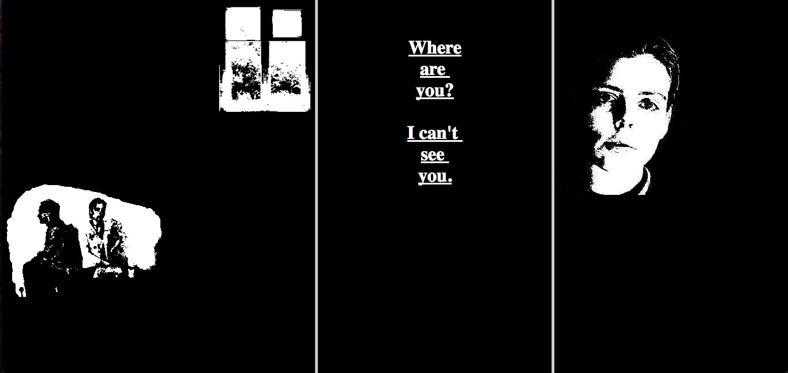

# По первой ссылке на сайте...

По первой ссылке на сайте http://myboyfriendcamebackfromth.ewar.ru/, можно посмотреть короткий и впечатляющий "классический" нет-фильм My Boyfriend Came Back From the War (1996) Оли Лялиной, сделанный из черно-белых медленно и прогрессивно загружающихся гифок, реплик-ссылок разными шрифтами и монтажа фреймами. Клики делят экран на всё более маленькие куски, каждый из них продолжает жить своей статической жизнью. Содержания каждого кадра ровно столько, сколько нужно, чтобы увлечься и продолжать кликать. Всё это вместе довольно страшно и круто.

Date: 2017-04-28 19:26
Likes: 37
Comments: 1
Reposts: 5
Views: 2055
Original URL: https://vk.com/wall-140963346_24

--------------------

  * Следующая ее работа agatha appears http://www.c3.hu/collection/agatha/ не менее впечатляюща, и она больше использует технически доступных средств в рамках веб1.0. 
    Ну, и конечно, на мобильных устройствах это посмотреть нормально нельзя.
    Author: 354122912, Date: 2017-04-28 20:15, Likes: 0*

