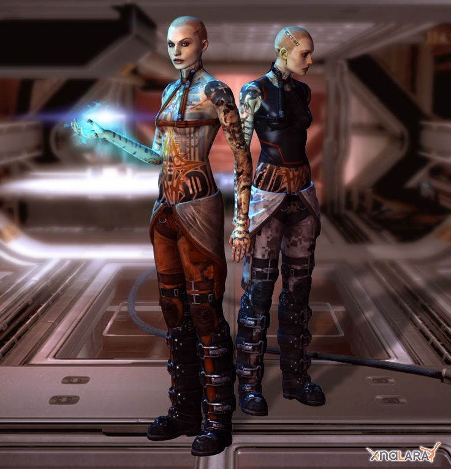

# Недавно я прошел Mass Effect...

Недавно я прошел Mass Effect 2. Впечатлила меня одна-единственная деталь, связанная с одеждой. Она прямо касается одного маленького спора Гёте и Беньямина, потому что речь идёт об “эстетическом представлении моральной борьбы”.

Mass Effect 2 – игра, которая пытается показать моральную борьбу. Сюжетно это более-менее сводится к следующему: протагонист, ради спасения мира, собирает себе команду очень талантливых людей, у каждого из которых, как и подобает талантливым людям, томный характер и какая-нибудь специфическая проблема со своим прошлым. Один и тот же “моральный выбор” повторяется с каждым из них: в какой-то момент член команды начинает намекать на свою проблему, и, если его расспросить, ставит перед необходимостью решить: либо мы сейчас летим мирить его с его детьми/родственниками/детскими переживаниями, либо нет. 

Опытный в этих вещах Гёте писал, что невозможно эстетически показывать саму моральную борьбу – либо добро победит (и тогда непонятно, в чём проблема), либо нет (и тогда это не эстетика, а какое-то извращение). Всё, что, согласно кровожадному Гёте, можно сделать – это показать уже сделанный выбор против добра, а потом продемонстрировать, как он сам приводит к наказанию (желательно, смерти). Описанный повторяющийся моральный выбор в ME2 делается драматичным через два противоположных мотиватора: с одной стороны, время поджимает, и если его тратить на все эти катарсисы, мир можно не успеть спасти. С другой, если на катарсисы забить, члены команды будут слабее и менее “мотивированы”, и потому быстрее погибнут, делая спасение мира не просто сложнее, но и обиднее – мы же к ним привыкли. В итоге выбор сводится к альтернативе между психологическим фарсом (окей-окей, мы найдем твоего отца, лишь бы ты стал стрелять получше) и кровожадной трагедией, в которой нарисованные живые существа будут драматично умирать, чтобы эмоционально наказать нашу лень. 

Хорошо, что у нас есть Беньямин, чтобы поспорить с Гёте. Для Беньямина каузальные связи между поступком и наказанием, да и вообще сам героический поступок, это абсолютно нереалистичная, мифическая ерунда. Поступки вообще не особенно от нас зависят (выбор в ME2, хотя и стоит перед нами, в общем-то почти что экономически обусловлен – сколько осталось времени и насколько у нас уже сильная команда?); другое дело – то выражение, которое им придается. Mass Effect 2 даёт совершенно гениальную возможность выражать моральный выбор. В нем есть персонаж по имени Джек, женщина, с которой в детстве очень жестоко обращались. В итоге она летает по галактике в очень-очень маленькой и достаточно парадоксальной смеси лифчика и портупеи. Если помочь ей преодолеть ее детские проблемы, появляется возможность одеть ее чуть скромнее. Это именно возможность, то есть вы вполне можете ее нужным техническим катарсисом “мотивировать” себе на пользу, и при этом оставить ее все такой же раздетой. Но именно в этом, вторичном и ни на что с боевой и экономической точки зрения не влияющем выборе ее внешнего вида и заключается возможность отнестись к ней хотя бы немного по-человечески. Этот эстетический выбор не был бы возможен без изначального, более насущного выбора, но именно он позволяет моральную интерпретацию первого: позволяет решить, ради чего мы на самом деле делали все эти вещи.

    Date: 2017-05-11 04:11
    Likes: 56
    Comments: 2
    Reposts: 5
    Views: 2671
    Original URL: https://vk.com/wall-140963346_28

--------------------

  * Как в озере поплавал
    Author: Vlad Shuysky, Date: 2017-05-11 04:25, Likes: 9

  * Вот так блог. Жаль что я счас работаю руками, так что не прочитаю его на два года аглубь в обозримом будущем, но буду поглядывать.
    Author: Vasily Afeev, Date: 2017-08-21 17:14, Likes: 0

