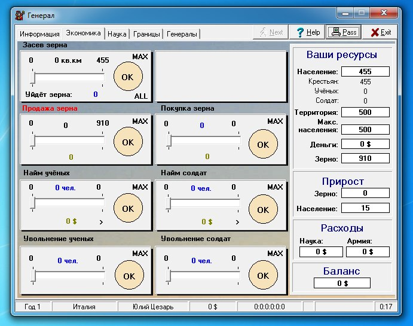
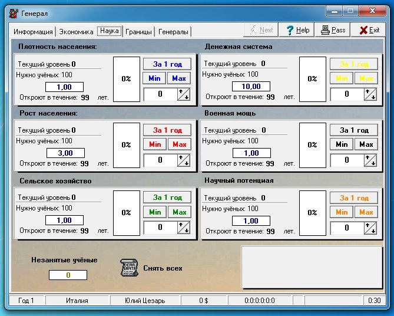

# Вот игра Генерал  бесплатная...

Вот игра “Генерал” (1999), бесплатная и очень популярная для своего жанра русская пошаговая виндоуз-стратегия, которая поддерживает игру против компьютера или по сети (в нее играют до сих пор). Ее написал в одиночку Дмитрий Гусаров, который потом сделал Космических рейнджеров (2002) и King’s Bounty (2008). В интервью[1] он объясняет свои гейм-дизайнерские решения “реализмом”. Под реализмом, наверное, стоит понимать не какие-то исторические прообразы происходящего (о каком времени могла бы идти речь?), но то, что думает о самом себе общество, в котором автор живет. Идеи, на которых построен “Генерал”, вполне отражают дух девяностых, дух русского “силового предпринимательства”, как его описывают социологи. 
 
Описывают они его так: когда в перестройку появились кооперативы, появилась и возможность их грабить. Так начался русский капитализм, и в его рамках бандиты продавали “силовой ресурс”: крышевание, наезды и тому подобное. В ходе своего неосознанно-профессионального становления бандитам предстояло узнать немало интересных вещей. Одна из них, превратившая их из “кочевых бандитов” в “оседлых”, заключалась в том, что не надо обирать совсем уж до нитки тех, кого крышуешь: без средств к существованию их бизнес закроется, и тебе придется искать новых жертв. Эта истина, многими бандитами выученная тяжелым путем, была зарей российского долгосрочного планирования, поводом осуждать “беспредельщиков” и вообще залогом рэкетирского личностного роста, и оказалась столь мощной идеей, что попала и в “Генерала”. Большая часть не очень разнообразного, но аккуратно продуманного игрового процесса заключается в ряде альтернатив между долгосрочными и краткосрочными благами: армия или ученые? изучать агрикультурные или военные технологии? Понятно, что подобный выбор - часть любой стратегии, но его масштабы и важность в данном случае приобретают практически дидактический характер. С одной из самых крайних ситуаций подобного выбора начинается каждый ход в “Генерале” - с того, что нужно вручную выделить крестьянам на посев часть зерна. Если этого не сделать, следующий ход будет голодным и вы неминуемо проиграете. Никакой выбор перед игроком не стоит; либо он это делает, либо проигрывает. Некоторые вещи по-другому, похоже, не выучить. 
 
Другая идея, которой осознанно посвящена эта игра, заключается в персонализме лидеров. Игра называется "Генерал", хотя играешь ты за президента, и речь идет вовсе не о твоей персоне. Дело в том, что помимо чисто экономических решений, игрок должен нанимать генералов, ориентируясь на их параметры - “Мастерство” и “Скорость”. От генерала в гораздо большей степени зависит исход сражения, чем даже от количества солдат. Не очень умелый генерал будет ограничиваться приказом “Пассивно наблюдать за противником”, который к победе приводит лишь за отсутствием такового. Трудно судить, насколько это реалистично отражает ту эпоху, изображать которую мифически претендует “Генерал”, но на необходимо персоналистский характер бандитизма, как и на общероссийскую веру в “сильного лидера”, это достаточно похоже. 
 
Стоит заметить, что и последний компонент игры, ее геополитические правила, вполне сочетаются с ситуацией 90-х, будучи воплощениями правой утопии об ius publicum europaeum (суверенное право воевать с кем угодно, отсутствие правых и виноватых в военном конфликте, при этом запрет на убийство мирных жителей и тому подобные вещи). Однако это вещи вполне типичные для стратегий. Понятно, что “Генерал” остается более-менее в рамках жанра, особенно столь общо понимаемого, как “стратегия”; но те акценты, которые он расставляет, делают игру лаконичным и убедительным выражением ранних зачатков российской идеологии. 
 
[1]: http://www.koalicia.genliga.ru/infa/gusarov.htm

    Date: 2017-06-08 13:18
    Likes: 41
    Comments: 1
    Reposts: 7
    Views: 2355
    Original URL: https://vk.com/wall-140963346_33

--------------------

  * Где линк на торрент?
    Author: Alexey Pshekov, Date: 2018-03-08 13:53, Likes: 0

