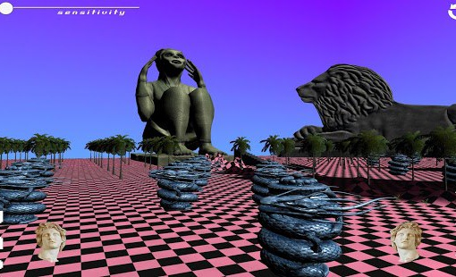

# Сейчас я расскажу почему компьютеры...

Сейчас я расскажу, почему компьютеры зависают. Зависание это одна из самых интересных вещей, которые происходят с компьютером, и, поняв зависание, можно отделить математику про компьютеры от самих компьютеров, можно ввести в разговор о них любимое философами понятие “нехватки”, ну и - должна же быть от моего паблика практическая польза - можно узнать, что делать, когда компьютер начинает тормозить. 
 
Компьютер работает, в первую очередь, с двумя типами ресурсов: временем (процессорным) и памятью (оперативной и дисковой). Несмотря на то, что компьютерные тормоза воспринимаются во времени, они обычно имеют отношение к нехватке памяти. Практически с самого начала компьютеры проектировались с учетом многозадачности - чтобы процессы, которые тратят много времени, ставились иногда на паузу и давали другим процессам тоже что-то поделать (это было связано с тем, что компьютеров было мало, а людей много, и они все хотели сидеть за одним компьютером одновременно). Поэтому какие-то затратные по времени вычисления компьютеру почти не страшны. Более того, любые лишние траты времени замечаются разработчиками сразу, и зачастую исправляются или хотя бы как-нибудь делаются незаметными. Траты же памяти уже давно никого не интересуют, потому что они абсолютно незаметны, пока память не закончится вдруг совсем. 
 
Когда оперативная память кончается, компьютер банально начинает пользоваться для восполнения этой нехватки жестким диском. Жесткий диск медленнее оперативной примерно в 10 тысяч раз. (Поэтому курсор, появляющийся при зависании макоси, “раскрашенный волейбольный мяч”, изначально, до раскраски, задумывался как изображающий жесткий диск). Разумеется, это сразу становится заметно. Некоторые компьютеры начинают издавать в таких ситуациях очень характерный скрип: это тарахтит жесткий диск. Поэтому, как только что-то начинает тормозить, надо открыть диспетчер задач, найти процесс, которому надо очень много памяти, и убить его. (В 2017 это наверняка будет таб браузера с каким-нибудь Gmail, и поэтому может быть актуальнее начинать пользоваться браузерным диспетчером задач, а не системным). Если тормоза совсем уж хронические, дело может быть в том, что кончается место на диске (тогда компьютер начинает запихивать файлы не куда ему удобнее, а куда получится, а потом бешено носится по всему жесткому диску в поисках того, что в принципе должно находиться сразу). 
 
“Computer Science” странная наука. Каким-то образом получилось так, что она не ограничивается изучением специфики конкретных механизмов, и располагает обширным математическим аппаратом, о котором биология или антропология, схожие на первый взгляд конкретностью своего предмета, могут только мечтать. Главное, что спасло Computer Science от превращения в “феноменологию машин Тьюринга”, это совершенно удивительный математический факт, вошедший в фольклор как корреспонденция Карри-Говарда: о связи формальной логики, придуманной сошедшим с ума Брауэром, который на компьютеры и смотреть бы не стал, и процессов вычисления, которые с точки зрения классической математики вообще не существуют (в ней всё уже как бы заранее подсчитано). Но об этом, может, в другой раз. 
 
Компьютер в принципе очень сильно отличается от машины Тьюринга. (Вообще “машина Тьюринга” и связанные с ней понятия часто используются неопытными программистами, чтобы доказывать, что все компьютеры это на самом деле один и тот же компьютер, а все языки программирования это один и тот же язык - ответ им можно найти в “Пармениде” Платона). А вообще, машина Тьюринга это очень тупой компьютер, которому доступны бесконечные время и память. У реального компьютера же, в принципе, бесконечно только время (несмотря на то, что нетерпеливым нам кажется, что время как раз конечно, а вот нехватку памяти мы не замечаем). Именно конечность памяти отличает компьютер от его математической модели и придаёт ему, таким образом, материальность. Это делает психоаналитическое понятие “нехватки” здесь легитимным, как и все следствия из него: нехватка памяти непредсказуема, приводит к непредсказуемым и иногда продуктивным последствиям, и относится к конкретности материальных обстоятельств, а не к сути алгоритма или математической модели. 
 
Помимо зависания, которое мы на полных правах можем обозначить психоаналитическим понятием истерики (acting out), проблемы с экономикой памяти приводят и к другим странным ситуациям. Важнейшей из них является ошибка “переполнения буфера”, относящаяся не к нехватке оперативной памяти вообще, но к переходу внутренних границ ее распределения. Если вы когда-нибудь заполняли бюрократическую форму, в которую не влезало ваше имя, и вам пришлось залезть на другие поля - с вами произошло именно “переполнение буфера”. Представьте себе, что эту форму потом читал кто-то столь же тупой, как компьютер, и воспринял то, что попало в эти поля, всерьез. Вот уже которое десятилетие этой маленькой нехватки места для записи чего-то банального хватало, чтобы взламывать систему за системой, распространять все виды вирусов, воровать деньги и государственные секреты.

    Date: 2017-10-30 18:54
    Likes: 137
    Comments: 2
    Reposts: 16
    Views: 5109
    Original URL: https://vk.com/wall-140963346_72

--------------------

  * это в тему рогьюлайков, несомненно! Скрипичная грамота для идиотов, как по мне.
    Author: Ksyushanchik Lyamina, Date: 2017-11-09 15:49, Likes: 0

  * Карри-Бразерсу паём мы песню
    Author: Andrey Keykeykey, Date: 2017-11-16 01:46, Likes: 0

