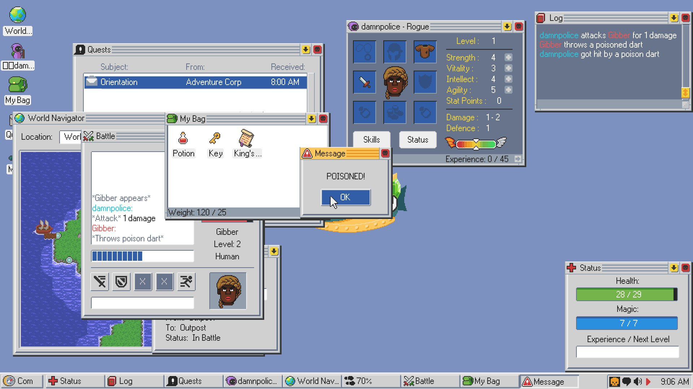

# Както когда я был маленьким...

Как-то, когда я был маленьким, я сел за компьютер в каком-то госучреждении одного наукограда, и обнаружил на нем базу данных всех квартир в городе. В этой базе можно было смотреть и менять количества комнат, метражи и даже доступность, скажем, горячей воды. Я очень хорошо помню, как задумался: а если я что-то поменяю, например, проведу воду нуждающимся, это изменится в жизни? И я что-то поменял. Не знаю, что произошло дальше с той квартирой, но мне потом немножко влетело. 
 
Это я вспомнил потому, что добрался наконец до компьютера с виндой и играю в Kingsway. Я уже писал про игры в этих виндовских интерфейсах, “симуляторы жизни” и подобные вещи. Они сделаны на основе знакомых всем по Windows формочек, доступных для использования любому программисту: достаточно было расставить все нужные галочки и кнопки в редакторе интерфейса Visual Basic, и программа почти готова. Можно было даже сразу соединить такую форму с базой данных Microsoft Access, в чем, в общем-то, и была основная их цель. Так вот, эта (эстетическая) форма “формы” мне кажется безумно интересной: в первую очередь потому, что корни этих формочек (кнопочек, полей ввода, галочек) действительно уходят в бюрократическую реальность какого-то высшего порядка. Почти всё здесь отсылает метафорически к бюрократическому учреждению: файлы, папки, галочки, в конце концов - кнопки, похожие на печати. И игры на основе таких формочек не произвольны; они интересны тем, что разлагают изображаемую ими жизнь на ровно те же самые элементы, что и бюрократические системы: имя, возраст, доход...
 
Есть некое (мифическое) разделение на статистику и зрелище, количественные факты и образ, отлично выстраиваемое в фильме Moneyball. Разложив зрелище игры на статистические данные, можно, якобы, достичь некой истины игры (в бейсбол), которая приведет к более эффективным решениям (в общем-то лишь их эффективность и позволяют этому разложению претендовать на истину). Однако, если воспринять этот процесс всерьез, то ситуация переворачивается: теперь зрелище оказывается вторичным по отношению к этим расчетам, и игроки теперь (даже, может, и не зная об этом) отыгрывают заранее вычисленный сценарий, создают зрелище там, где исход уже предписан статистикой. (То, что статистика не может предписать результат конкретной игры, не очень важно, когда критерием истины является эффективность в индустриальных масштабах). Реслинг оказывается просто самым осознанным спортом из всех. Наверное, можно уступить, что в спорте до этого еще далеко, но в принципе такова натура бюрократизированной реальности. Частенько приходится действительно разыгрывать из себя именно того человека, которым я являюсь исключительно по документам. 
 
Так вот, если взять интерфейс “симулятора жизни”, похожий на историю болезни, то можно сказать, что он не просто изображает какую-то жизнь, а отсылает непосредственно к той странной бюрократической истине, будучи интимно связанным с данными, которые хранятся ровно в таком же документе. И в этом смысле такая игра - попытка вернуть контроль над жизнью, пытаясь контролировать уже не ее зрелищные аспекты, а некие (мифические) стоящие за ней факты. Зрелище, по желанию, можно проигрывать у себя в голове или выдумывать в виде вторичного развлечения. Похожим образом Джек Керуак придумывал свой фантазийный футбол: так же, как у сюрреалистов или Наке (я писал о нём), что-то человеческое он заменял на случайность, разыгрывал бросками кубиков саму игру, а потом выдумывал к ней захватывающий репортаж. Настоящая субъектность бюрократизированного века разыгрывается на этапе записи фактов, заполнения документов. В играх такого типа речь идёт о преодолении этой формы “формы”. 
 
(Сам Kingsway отходит от оригинального интерфейса виндоуз до его практически буквального изображения, что позволяет достичь немного другого порядка абстракции. Это игра, пожалуй, не столько про сам интерфейс, сколько критика жанров (RPG и roguelike) с позиции интерфейса, при помощи остранения их интерфейса и демонстрации того, как, например, недалеко ушли метафоры в этих жанрах (такие, как квесты, которые всё больше напоминают задачи в системах управления проектами)).

    Date: 2017-12-16 02:12
    Likes: 80
    Comments: 3
    Reposts: 6
    Views: 4215
    Original URL: https://vk.com/wall-140963346_85

--------------------

  * это блог - моя самая нежно любимая виртуальная сущность
    Author: Anya Schetvina, Date: 2017-12-16 02:26, Likes: 0

  * Охуеть, ты жив!
    Меня как-то цепанула безаппеляционность в утверждении, что некая отсылка действительно существует - это всегда хотя бы немного, но сознательный акт, тогда как тут, насколько я поняла это ощущение действительно обусловленно формой и выбором формы, которая, да, неизбежно атрибут бюрократизма, но действительно видеть в этом законченный смысл, вероятно так же, как утверждать, что нет-арт работа “form” - это такой визуализированный страшный сон создателя(ну допустим) баз данных, где все любые объекты неизбежно теряются в рандоме.
    Это очень поэтично, нооо ооооочеееень наатяяянутоооо
    Author: Neuro Askesis, Date: 2017-12-16 06:05, Likes: 0

  * [id354122912|Neuro], меня больше удивляет что остальные живы в пятницу ночью)
    
    Да, может, стоило по-другому выразиться, я не подумал об этом, спасибо. А так, для меня вопрос об осознанности вообще не стоит, особенно с теоретической точки зрения.
    Author: Valentin Golev, Date: 2017-12-16 07:46, Likes: 0

