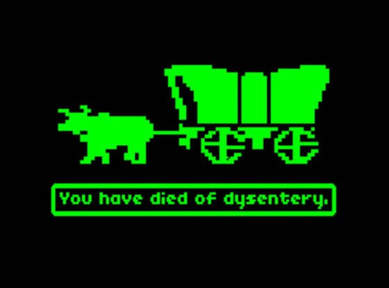

# Главный символ с которым играют...

Главный символ, с которым играют игры, это символ смерти. Вообще, чем занимается игрок? Он постоянно умирает, умирает, умирает, пока не доходит до той точки, после которой умирать уже не выходит (он “прошел игру”) – тогда он бросает игру и берется за другую. То, что открыла Dwarf Fortress (“погибать – здорово”, заметьте, это не “изучать системы игры – здорово”), в общем-то было в играх всегда – игрок играет, потому что он хочет умирать, умирать и умирать.

Важнейшая теория о знаках в играх утверждает, что игра пользуется насыщенными ассоциациями знаками из “реального мира”, чтобы соблазнить нас, дать нам начальный набор фантазий, облегчить вхождение в игровой процесс – а потом потихоньку переопределяет эти знаки в том смысле, в котором они участвуют во внутреннеигровой экономике. Мы начинаем с определенными представлениями и опытом о том, что такое водка “на самом деле”, но потихоньку приучаемся к тому, что водка это “-3 к интеллекту, +1 к харизме на 2 часа”. Смерть, как главный игровой знак, как будто бы следует тому же пути: игра переопределяет смерть, как некую вялую потерю (времени, ресурсов, “прогресса”), в то время как в жизни опыт смерти это что-то серьезное и трагическое…

Нет, однако, никакого в жизни опыта смерти. Его никогда не было, даже у Сократа, а в какой-то момент его как будто бы стало еще меньше – возможно, потому что люди в Eвропе перестали умирать с такой частотой. Где-то на подходе к 20 веку философов стал всерьез интересовать вопрос: как же смерть влияет на человека? В этом вопросе слышится некое сомнение в том, что смерть является чем-то неотъемлемым. У нас есть только постоянный опыт не-умирания, утомительный, бесконечный. Игры нас от него избавляют, и в то же время дают некий опыт смерти – абсурдно и в то же время глубоко соответствующий "реальному", определяемому лишь как отрицание именно этой, геймерской фантазии.

Один из самых интересных мифов о возникновении игр состоит в том, что в какой-то момент игра и гадание были одним и тем же процессом, а потом оказались разделены (“Змеи и лестницы” были одной из таких игр). Их разделила “реальная жизнь”, чья утомительная навязчивость появилась, по-видимому, в тот же момент: по степени соотнесенности с судьбой игра оказалась ниже жизни, а гадание выше. Если игра пользуется аутичными знаками – рожденными из жизни, но замыкающимися на себя, вычитающимися из жизни, то гадание, наоборот, оперирует знаками распущенными, готовыми принимать на себя любые "реальные" значения, чтобы вписать их в какой-то нарисованный на небе или картах Таро образ судьбы.

Это не просто конкретные практики, но режимы отношения со знаками в принципе, в которые мы постоянно впадаем, даже если не готовы признавать эти моменты за гадания или игры. Мы играем по правилам, влюбившись в детали и исследуя мелочи, удаляясь ради них от всех и всего; боясь потерять связь с миром, придумываем и загадываем для мелочей высший смысл и роль в своей и всеобщей судьбе; почувствовав свою беспомощность, вновь бежим в понятные маленькие исследования... Испуганно балансируя между этими двумя режимами, жизнь продолжает тянуть свое постыдное ярмо.

    Date: 2018-06-03 11:07
    Likes: 153
    Comments: 10
    Reposts: 22
    Views: 5383
    Original URL: https://vk.com/wall-140963346_161

--------------------

  * Игрок играет, чтобы выполнять интересные ему игровые задачи.
    Author: Krolik. Paskhalny., Date: 2018-06-03 17:22, Likes: 0

  * Что вполне соответствует «изучению систем игры».
    Anyway, that’s not the point.
    Author: Artur Orlovsky, Date: 2018-06-03 18:12, Likes: 0

  * [id384347083|Elvenskin], это, как раз, is the point. Death - that is not the point. Even in DF, where we have no losing at all despite the "Losing is fun".
    Author: Krolik. Paskhalny., Date: 2018-06-03 18:16, Likes: 0

  * Эссе не пытается в полной мере ответить на вопрос мотивации играть. Не понимаю, почему ты придрался к этому, придав буквальный смысл фразе про желание "умирать, умирать и умирать", так ещё предложив довольно ограниченный ответ на вопрос мотивации.
    Author: Artur Orlovsky, Date: 2018-06-03 18:29, Likes: 0

  * Что значит «we have no losing at all”?
    Для меня смерть в ДФ — важнейшая часть игры, потому что самое интересное в порождающихся игрой историях — насколько безумным образом слаженная система пришла к краху.
    Author: Artur Orlovsky, Date: 2018-06-03 18:33, Likes: 0

  * [id384347083|Elvenskin], это только одна из возможных точек зрения. Для меня в ДФ нет поражения вовсе. И меня не интересует уничтожение крепости само по себе - лишь в контексте более широкой истории, истории игрового мира.
    
    А придрался я из-за того, что эссе начинается с предпосылки, которая... Попросту неверна. Это суждение о том, что игрок "постоянно умирает, умирает, умирает", хотя далеко не во всех играх есть даже "проигрыш" сам по себе. "Игрок умирает, потому что он хочет умирать, умирать и умирать" - какой игрок? Автор? Или всякий игрок? Или 73% игроков в возрасте от 18 до 32 лет на территории США? Ответ - воображаемый игрок в голове автора.
    Author: Krolik. Paskhalny., Date: 2018-06-03 18:49, Likes: 0

  * Да, разумеется, это одна из точек зрения.
    Но ты первым говоришь что "death is not the point, even in DF". С претензией на объективность, полагаю.
    Как я уже сказал, ты придаёшь буквальный смысл этой фразе, хотя она нисколько не является серьёзной. Честно говоря, я вообще воспринял эссе как несколько независимых идей, которые волей судьбы оказались по соседству, сшитые нитью ассоциативного ряда. Может, я неправ, но отвергать весь текст на основании "ложной предпосылки" точно не стоит, потому что никакого ряда логических умозаключений тут не наблюдается.
    Author: Artur Orlovsky, Date: 2018-06-03 19:09, Likes: 0

  * [id384347083|Elvenskin], как раз я об этом говорю не первым.)
    
    В любом случае, не думаю, что нам стоит продолжать эту дискуссию, так как мы, очевидно, как-то по-разному смотрим в первую очередь на само эссе. И мне не хочется спорить просто ради спора.
    Author: Krolik. Paskhalny., Date: 2018-06-03 19:17, Likes: 0

  * [id154191131|Krolik. Paskhalny.] [id384347083|Elvenskin Dextrous] спасибо за ваши комментарии. у игр очень сложные отношения со смертью, и, конечно, нельзя обобщать совсем уж; самое загадочное в этом, скорее, наличие этих отношений. то же и с судьбой: игры как-то соотносятся с судьбой. об этом трудно говорить, потому что всегда понятно, что речь никогда не идет о "настоящей смерти" и "настоящей судьбе", однако когда и где речь может идти о них? не можем ли мы сказать, что само выделение игр в отдельную, особую человеческую практику, их вычитание из гадания и противопоставление жизни, является тем ходом, который позволяет нам говорить о тех самых "настоящих смерти" и "судьбе"?
    
    для меня вопрос не в доказательстве какого-то тезиса здесь, но скорее в поиске возможностей найти в языке какую-то связь между играми, смертью и судьбой, которая сейчас, по-моему, одновременно подразумевается и ускользает. если получится говорить об этом, тезисы смогут появиться после. я пишу большой текст об этом, он идет довольно тяжело, но я надеюсь его скоро закончить и показать. спасибо за комментарии - я надеюсь, они помогут мне как-то лучше сформулировать и акцентировать какие-то моменты
    Author: Valentin Golev, Date: 2018-06-03 21:43, Likes: 0

  * Ты рассматриваешь исключительно игры?
    Всё же мне они тут видятся подчастью make-believe практик, причём наименее значимой, потому что в других изменить реальность и заставить тебя поверить — основная цель, а здесь — второстепенная, лишь для удобства восприятия и изучения правил игры.
    Ну да ладно, отложу обсуждения до непосредственной публикации.
    Author: Artur Orlovsky, Date: 2018-06-03 22:09, Likes: 0

