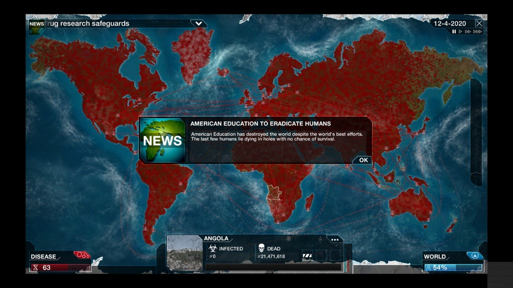

# Вс о чем думаю в...

Всё, о чем думаю в последнее время – материалистические гадания. Но сказать придется, что субъект игрока больше всего похож на субъект эволюции. Какая еще сила может сохраняться, умирать, восстанавливаться, проверяя, какая из параллельных жизней не приведет к гибели? “Сохранение” и “размножение” оказываются одним и тем же – возможностью попробовать что-то, не боясь, что любой другой путь будет утерян навсегда. Размножение в природе и сохранение в игре позволяют нам попробовать смерть.

Игры, изображающие эволюцию, постоянно сталкиваются с проблемой, знакомой нам еще по сказкам – особь (а привычный протагонист это особь) конкретна, а род и вид абстрактны; игры, в силу необходимости играть за что-то непрерывное и конкретное, изображают эволюцию особи, в то время, как “на самом деле” каждая особь остается неизменной, и все развитие происходит на абстрактном уровне, абстрагированном от количества – это игроку недоступно. Удивительна CK2, в которой игра происходит за “род”, трудноопределимую сущность, чье материальное воплощение непредсказуемо меняется в соответствии с легальным и физическим насилием – в итоге порождая похожий род субъекта, который создается через постоянную передачу чего-то по наследству, а именно – самой сущности. У Ника Ланда вычитал гипотезу, что идентичность вещи, ее равенство самой себе было изобретено именно через наследство, примогенитуру – мы видим в СК2 иллюстрацию этого странного, нематериального постоянства. Вещь – это то, что наследует само себе во времени.

Нет никакого “выживает сильнейший”, есть только “кто выживает, тот приписывает все достоинства себе”. Сохранения как будто исключены из понятия “прохождения игры”, однако понятно, что настоящее прохождение опирается на все свои неудачные ветви, опирается каким-то странным образом, находя в них все больше и больше особой, “отрицательной” информации, которая информативна только потому, что ошибочна – эти, потраченные жизни не существуют, кроме как то, от чего постоянно отталкиваются выживающие. В этом трудно не увидеть материалистический, эволюционный способ читать “Историко-философские тезисы”; в них Беньямин, сын старьевщика, говорит об особого рода наследстве, которое победители никогда не могут принять до конца.

Что это за наследство? Любое желание, умирая, обращает весь свой пройденный путь в символ, что не может читаться иначе, как неудача – не потому, что путь был в неправильную сторону (нет никакой изначально неправильной стороны), а наоборот, потому что убеждать себя в правильности может только не успевший умереть. В одном из своих странных сочинений Кант, величайший противник мистики, изобретает вдруг модернистское гадание – он смотрит на революцию, событие, при котором “великое становится для людей ничтожным, а ничтожное — великим” и “как по мановению волшебства великолепные древние государства исчезают и на их месте возникают словно из-под земли другие”, и видит в нем варварство, неудачу, но одновременно – символ желания, которое одно, передаваясь по наследству, оказывается способным предсказывать будущее.

    Date: 2018-07-20 02:07
    Likes: 48
    Comments: 2
    Reposts: 5
    Views: 3398
    Original URL: https://vk.com/wall-140963346_233

--------------------

  * девочки, записываемся в чятек😍😍😜💅💅💅🙀🙀
    
    (https://vk.me/join/AJQ1d_uIGQNGanEIzznggfJo)
    
    >Идейный наследник паблика "биоробот"
    
    >Рациональные дискуссии, обсуждения новостей с легким уклоном в сциентизм-трансгуманизм
    
    >По пятницам - восхваление бога из машины
    Author: Naturalist Junior, Date: 2018-07-20 02:19, Likes: 2

  * возможно эти мысли обслуживают травму послереволюционных переселений, "интернационала", ссылок и тп
    Author: Timofey Usikov, Date: 2018-07-20 04:09, Likes: 0

