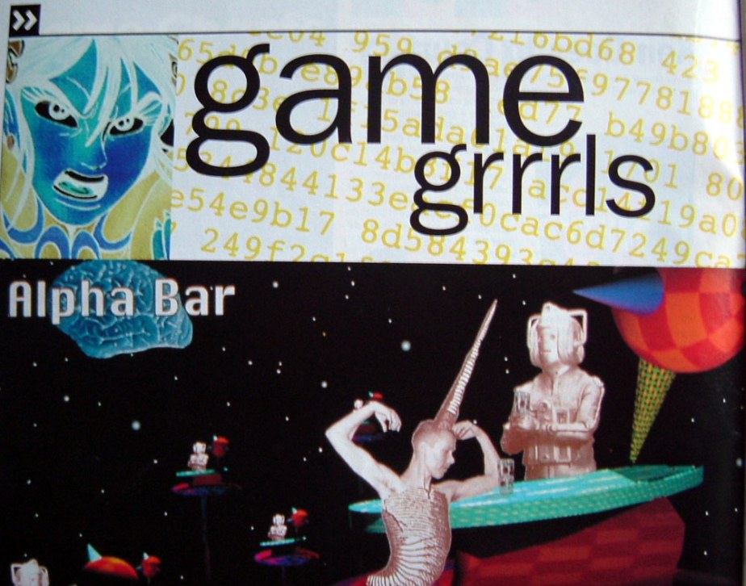

# По поводу Everything музеев и...

По поводу “Everything”, музеев и “игры – искусство?”. Вообще на такие темы все время приходится себя одергивать, но мы тут как-то заобсуждали это с ребятами из ЛИКИ и мне показались интересными – и актуальными – некоторые моменты, попробую поделиться.

Вот есть Everything, которая по сути – эдакий постер-чайлд “игр как искусства”. Вообще я очень старый фанат Орейли (аниматор, автор игры), еще со времен Octocat Adventures, но конкретно Everything, кажется, превращается в довольно унылый феномен. Сам Орейли довольно интересную вещь говорил в одном из интервью[1]: мол (я своими словами), игры умудряются вполне обойтись без “арт”, и этим они и интересны – им (пока что) не нужно себя легитимировать, не нужно, чтобы какие-то признанные культурные институции их выставляли, они отдельно и музеи отдельно, и это вроде как и хорошо. Вот, то есть, в общем-то, всю эту историю с играми в “Гараже” можно читать не как “Гараж признал игры, они теперь искусство”, а как “Гараж пытается угнаться за тем, что действительно классно”; а некоторые тексты, которые на эту тему пишут (“как много Гараж дает играм, выставляя их”) – это просто маразм.

Так вот, когда мейнстримовые учреждения русского искусства (вообще неясно, насколько искусство (я имею в виду “Искусство”, все это институционализированное поле-полище) в 2018 можно всерьез делить на мейнстрим и нет: если ты хочешь в музее выставиться, твой разрушительный потенциал уже не впечатляет) “принимают” в себя игру, они берут Everything. А Everything – ну вы же играли – это вылизанный проект из абстрактных животных, сдобренный идиотским нью-эйджевым комментарием о том, что все в мире связано – чем-то вроде того, что вам будет втирать с круглыми глазами на час дольше, чем возможно слушать одноклассник, которого угостили кислотой. Это игра осознанно “аполитичная”, то есть буржуазная и консервативная; ее содержание – абсолютно не-полемично, она совершенно безопасна, импотентна, и полностью уничтожает какой-либо разрушительный потенциал от включения игр в пространство “Искусства”. В нее даже можно не играть – просто поставить на фоне, она сама будет играться. Я напомню: игры брали на себя разрушительную, критически-эстетическую функцию радикального искусства очень давно – не в последнюю очередь через феминистские и квир-проекты (от VNS Matrix до Anna Anthropy, Robert Yang, и так далее и тому подобное), приписывать Everything какое-то критическое первенство в чем-то – идеологическая подмена, bait-and-switch. Брать именно эту игру на музейные знамена – трусливый, комфортный, буржуазный выбор.

Вопрос, однако, в том, почему же игры пока почти что обходятся без музеев и без “Искусства”, или, если позволить себе расслабиться и не ставить слишком конкретные вопросы, в чем же особенность этой формы. Ну понятно, что потому что интернет, дистрибуция, бла-бла-бла; потому что директора музеев – старперы и так далее. Но есть еще такой момент, что одна из важных буржуазных фантазий по поводу “Искусства” – когда ты не глаз на открытку бросил, но перед картиной сел и сидел много часов – воплощается в играх естественным для формы образом. Игры потребляются не как фильмы (у которых фиксированное время просмотра) или картины, а очень растянуто во времени, и при этом, в определенном смысле, одиноко. Это делает их действительно неподходящими для музеев; но это еще и делает их слегка необычным объектом для критики (эссеистики). Дело в том, что в игры играть сложно и долго (и дорого); а развиваются их интерфейсы так быстро, что в старые игры играть просто-напросто неудобно. Как показывает успех Twitch, есть действительно огромный спрос на то, чтобы кто-то играл за нас. Есть одна хорошая, почти утраченная традиция в арт-критике – начинать текст с подробного, точного описания самой работы, а выводы и впечатления вводить только после. Возможно, как ни странно, игры требуют такого же подхода – особенно, когда мы захотим обращаться к читателям, которые не играют вообще. Описать опыт игры не так уж легко, ведь игры нацелены на переизобретение опыта. Попробуйте сами. Я вижу в этом очень интересный, хорошо-забытый-старый шаг с точки зрения не просто письма об играх, но письма об искусстве, письма о жизни и письма вообще.

[1] https://nodontdie.com/david-oreilly

    Date: 2018-08-04 12:21
    Likes: 54
    Comments: 7
    Reposts: 8
    Views: 3852
    Original URL: https://vk.com/wall-140963346_237

--------------------

  * а разве не все в мире связано, Валя?
    Author: Pavel Gurov, Date: 2018-08-04 12:22, Likes: 0

  * [id417218|Pavel], связано, но не милым-красивым способом, что у Орейли, а гораздо более ужасным, как у Аллана По)
    Author: Valentin Golev, Date: 2018-08-04 12:25, Likes: 0

  * [id1042307|Валентин], блин, я вспомнил этого ОРейли, его же мультики по "дважды два" показывали. мне они тогда кстати как раз довольным жуткими казались
    Author: Pavel Gurov, Date: 2018-08-04 12:27, Likes: 0

  * [id417218|Pavel], вот тогда он был крутым)
    Author: Valentin Golev, Date: 2018-08-04 12:28, Likes: 0

  * По поводу последнего абзаца насчет описания. Ситуация с играми похожа на историю про слепую ученую, изучающую красный цвет. Она знает про него все, но не видела его по-настоящему.
    Игры интересны тем, что их нельзя пересказать. Опыт от игры нельзя трансформировать ни во что другое - ни в текст, ни в летсплей с твитча. Чтобы этот опыт получить, нужно именно _сыграть_
    Author: Gleb Mikhnovets, Date: 2018-08-04 13:02, Likes: 0

  * [id18379504|Gleb], ну тем интереснее писать и читать об этом. во все игры не сыграешь)
    Author: Valentin Golev, Date: 2018-08-04 13:12, Likes: 0

  * Фактически, постер чайлд игр, как искусства - это Journey, её, насколько знаю, часто выставляют в таком контексте. Тоже старый любитель творчества Орайли, но мне наоборот кажется, что в этом поле он интереснее или, как минимум, трогательнее. У меня, видимо, совершенно обратная реакция на Everything. Когда я впервые в ролике увидел медведя на прямых лапах с огромными болтами, который без анимации, одним фреймом, упал еблом в землю, а потом так же встал на голову и сверху заговорил Уоттс, чье мировоззрение мне всегда было близко, я, кажется, вскрикнул от восторга. Но это первое впечатление от формы. А по факту, говоря об искусстве, Орайли рассуждал о той степени стагнации, когда искусство начинает говорить о самом себе, отделяясь от человека и природы - от прекрасного, с чем я согласен и эту тему хорошо раскрыл Фромм в Анатомии человеческой деструктивности в главе про, кажется, манифесты итальянских футуристов времен первой мировой войны и некрофилию. 
    Да, Everything - безопасный вариант для выставки, но и более универсальный. В это пространство я мог бы пойти со своей маленькой дочкой и она бы поняла игру, интересно и весело ей было бы точно, чего не произошло бы, например, с Cobra Club. И особенно Everything, как и Mountain, актуальна в таком контексте, потому что созерцание - основной механизм взаимодействия с ней.
    
    Не совсем понял, что имеется ввиду под разрушительным потенциалом. Игры Анны полностью человечны и интимны, Янга - тоже, хоть и провокационны. Но это выражение свободы и, если разрушение присутствует, то это разрушение границ дозволенного. Янга когда-то не взяли на работу, потому что его моды были нетрадиционны для того времени. Раз такое дело, вот вам игра про отсасывание кожаной пушки в мужском туалете. Вызывающе, но о человеке и жизнеутверждающе.
    
    В этом смысле Everything и Mountain, пусть безопасны, тоже имеют разрушительный потенциал: созерцательность, необходимая для добродетили, утратила значимость в современной культуре, в которой все стремления направлены на максимальную стимуляцию всех чувств. Для многих, 30 минут сидения на месте в тишине и с закрытыми глазами покажутся мучением, это большая беда. Люди, хотя варятся в больших котлах городов и связаны общей сетью, все более изолированны, что для человека чуждо. В большей степени популярность твича обусловлена стремлением к единению и временному разрушению эго. Mountain и Everything не только, в некотором смысле, об этом человеческом моменте, но еще и обладают потенциалом подтолкнуть (по крайней мере тех, у кого есть к этому расположенность) к таким ощущениям. А это уже целительные свойства. При этом, они обе вполне искрение и без претензии, чистые.
    
    В общем, не со всем согласен, но подписался и очень рад, что набрел сюда. Раз в несколько лет позволяю себе заглянуть в русское медиа пространство, связанное с играми и долго после этого не могу стряхнуть с себя гнетущую экзистенциальную тоску. Рад, что эта вылазка оказалась плодотворной и удалось найти людей с качественными мыслями.
    Биг ап!
    Author: Gimme Sugar, Date: 2018-09-26 04:30, Likes: 0

