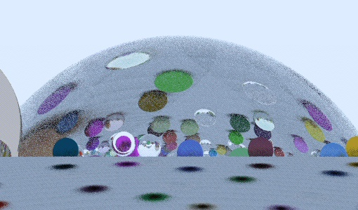
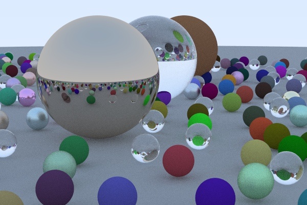
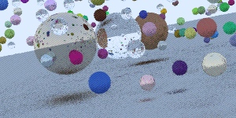

# Как и любой нормальный человек...

Как и любой нормальный человек, заперся в комнате и пишу рей-трейсер. Рей-трейсер это такая штука, которая рисует “реалистичные” картинки с трехмерными сценками. Он отслеживает на лучики из глаза к предметам, высчитывает, обо что они спотыкаются, куда отражаются и как рассеиваются, и так получает новые лучики, которые тоже можно рассчитать. Если лучик из глаза уткнулся в зеркало, то он увидит то, куда уткнется другой лучик – отраженный от зеркала: реалистично выходит. А если лучик ударился об деревяшку, он по-другому будет рассеян, и добавит к собственному цвет деревяшки свет, который на него попадет: так получаются тени и всё такое. В итоге картинка может быть сколь угодно близка к тому, что мы “на самом деле” видим. Короче, совершенно удивительная штука, особенно теоретически, а практические “результаты” пока не особо хочу показывать (но думаю написать небольшой технический туториал, потому что делаю несколько необычных вещей + это всё на Haskell, что довольно весело).

Рей-трейсинг оказывается очень важной идеей с самых разных сторон. Кстати, Богост вот связывает с ним появление стрелялок: именно рей-трейсинг, только уже не для моделирования света, а в направлении выстрела, определяет попадание при стрельбе в игре. Но мне кажется, что можно пойти дальше. Бросается в глаза, например, что рей-трейсинг очень сильно напоминает то, чем занимается Мишель Фуко в “Придворных дамах”: ну вы помните, наверное – "От глаз художника к объекту его созерцания властно прочерчена линия, которую мы не можем избежать, рассматривая картину...". Этот текст, предисловие к “Словам и вещам”, очень любим арт-критиками, потому что, наверное, задает некоторый стандарт внимания к восприятию (немного более фундаментальной штуке, чем “идеи” и всякие “автор как бы хотел сказать”); именно это внимание к восприятию и являет собой рей-трейсер – в рамках определенной концепции восприятия, конечно, критика которой может быть представлена через критику самого алгоритма.

Но куда более близким к идеям алгоритма мне кажется текст Мерло-Понти “Око и дух”. Для Мерло-Понти ставка в том, чтобы показать, как восприятие, в первую очередь – визуальное восприятие – является неким основательным процессом для мышления, а не просто поставщиком данных для последующей логической обработки. Он пишет о Сезанне, например, как о ком-то, кто открывает новые виды мышления. Рей-трейсинг, алгоритмизируя взгляд, может, наверное, как будто бы от этих всех континентальных душещипательных размышлений убегать. Но мне кажется, рей-трейсинг просто надо научиться читать; тот факт, что какая-то технология построена на каких-то научных редукциях, не значит, что она не означает больше, чем эти научные редукции хотели бы ей позволить; более того, мы до сих пор не видели вменяемой науки о технологии (кибернетика – отличный пример скудости научных возможностей): если наука и является поставщиком грамматик технологий, “тексты”, которые ею пишутся, выходят далеко за ее пределы.

Так вот, рей-трейсинг явно и четко иллюстрирует странный тезис о том, что взгляд предшествует глазу, что это взгляд делает возможным глаз, что, чтобы быть видимыми, предметам нужно уметь видеть друг друга и нас. Этот тезис, зарождающийся между Мерло-Понти и Лаканом (6 глаза 11-го его семинара, посвященная именно этому, захватывает воображение), сходу не прочтешь материалистически: а тут, при рей-трейсинге, каждая точка, видимая глазу (“камере”), сама – рекурсивно – превращается в глаз. Только этот факт делает возможным изображение.

“Материал” – понятие, ключевое для рей-трейсинга: это он задает то, как именно рассеивается свет. Материал предмета, при его изображении, задается именно его способом рассеивать свет: наличием блика, формой отражений, такого рода вещами. Интересно, что то, что с определенной точки зрения лишь “внутри”, оказывается выражено исключительно через отношения предмета с внешним миром: мы узнаем зеркало не благодаря его собственному цвету, но благодаря тому, что мы узнаем в нем все остальные предметы в нем; мы узнаем воду на асфальте даже не по ее текстуре, но по бликам – отражению света фонарей. (Забавная история про воду на асфальте, которую я вычитал на каком-то техническом форуме про рендеринг: в фильмах ночные сцены постоянно снимают в дождь или после дождя, потому что без воды они выглядели бы слишком темными и пустыми). Материя оказывается вновь противопоставлена “форме”, но не спрятана внутрь вещи, а, наоборот, начинает выражать собой самую суть ее отношений с внешним миром.

Потом еще что-нибудь напишу об этом. Всем привет.

Date: 2018-08-28 23:48
Likes: 93
Comments: 8
Reposts: 12
Views: 5072
Original URL: https://vk.com/wall-140963346_244

--------------------

  * Если «генеалогически», то глаз не камера и рей-трейсинг просто заполняет «репрезентацией» пустоты в уже готовой знаковой схеме. Но я понимаю соблазн.
    Author: 308091648, Date: 2018-08-29 00:13, Likes: 0*

  * [id308091648|Andrey], не очень понял, но жду твой текст о перспективе! кстати, мой рейтрейсер очень раушенбаховским становится, ничего красивого из этого пока не вышло, но я работаю над этим
    Author: 1042307, Date: 2018-08-29 00:16, Likes: 0*

  * из-за академического рисунка я могу рейтресинг до определенной степени. офигенное умение позволяет понимать свет как объект с бесконечным свойством, в результате можно начать думать о свете как о первичном в восприятии , что вы собствено и сделали, очень интересно, спасибо
    это мой рисунок учебный
    Author: 153996098, Date: 2018-08-29 07:28, Likes: 0*

  * Тоже вспомнил, как в универе писал для лабораторной трассировщик лучей. Было очень красиво!
    Вообще, есть современное направление исследования, связанное с убыстрением этого процесса за счёт стохастической трассировки только в местах наибольшей значимости.
    Но на этих картинках у меня, естественно, полная трассировка с несколькими отражениями.
    Author: 11858797, Date: 2018-08-29 09:05, Likes: 0*

  * Слева - Ещё один скриншот со стенками и более низким коэффициентом отражения. А справа - картина какого-то омского современного художника. Мне кажется, похоже на рейтрейсинг)))
    Author: 11858797, Date: 2018-08-29 09:08, Likes: 0*

  * «Этот тезис, зарождающийся между Мерло-Понти и Лаканом (6 глаза 11-го его семинара» – забавная опечатка :)
    Author: 114367080, Date: 2018-08-29 12:14, Likes: 0*

  * спасибо ребята!
    Author: 1042307, Date: 2018-08-29 23:08, Likes: 0*

  * Мне очень нравятся параллели между доплатониками и пифагорейцами и историей компьютерной графики и игр. Дихотомия пиксельной/векторной графики — атомы и неделимое, треугольники пифагорейцев и тесселяция, и опять же пифагоровская идея о зрении как о испускании лучей, которыми мы «щупаем мир», и рейтрейсинг. У Мерло-Понти это превращается в метафору механизма визуального восприятия, внимания, т.е. по сути конкретный нейробиологический механизм, но мне всегда казалось что пифагорейство, как и цифровая графика здесь начинаются с построения идеальной модели, оторванной от чисто человеческого восприятия. Просто Пифагору не на чем было тестить свои алгоритмы рейтрейсинга. Такой вот античный киберпанк
    Author: 12403279, Date: 2018-09-11 10:46, Likes: 0*

