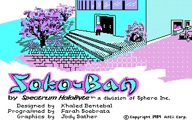

# Наслаждаюсь Baba is you постСокобаном...

Наслаждаюсь «Baba is you», пост-Сокобаном с милыми кроликами. Сокобан, клаустрофобная игра про маленького человечка, двигающего коробки, внутрь которых невозможно заглянуть, была продуктом и комментарием к японскому экономическому чуду — ты должен эффективно перестроить маленькое индустриальное пространство, сделав минимум движений. В «Баба это ты» ситуация совсем безвыходная и требует обращения к старинному способу борьбы с клаустрофобией, переинтепретации: “بابا أنت”, отец это ты, в нужных рамках ты переинтерпретируешь предметы, связываешь по-новому символическое и образное (imaginary). Это та же логика, которой пользуется Израильская Оккупационная Армия, переопределяющая, прямо и непонятно зачем ссылаясь на Делеза, стену как проход, а улицу как стену. Ее солдаты взрывают стену между квартирами, натыкаются на палестинскую семью за просмотром телевизора, загоняют ее в чулан – новая интерпретация работает только для евреев – она принадлежит породившей ее идентичности. Смена правил строится на однозначности, дискретности идентичности, у которой теперь есть четкие границы. Аватарка субъекта меняется, но остается неизменным его размер — мир интерпретируется Декартом наложением регулярной квадратной сетки, и в этой сетке человек и его мечты могут быть любыми фигурами. С похотливым кроличьим телом не вылезти с этого склада, но я это камень, а стена это победа. «Отец это ты», конечно, кто ж еще, ты сам себя называешь, и на этой связке имени и образа строится вся твоя сила и вся ее ничтожность. Сдвигая свою идентичность, случайно объяви себя ничем — теперь ты сама черная земля, и ничто не заметит твоих движений.

    Date: 2019-06-07 02:22
    Likes: 45
    Comments: 3
    Reposts: 1
    Views: 3349
    Original URL: https://vk.com/wall-140963346_345

--------------------

  * Чудесная игра
    Author: Igor Debatur, Date: 2019-06-07 08:51, Likes: 1

  * Ты если взорвешь стену между квартирами, то твою палестинскую семью придется из всех дыр выковыривать, ибо у кумулятивной пластидной рамки безопасное расстояние - 30 метров за укрытием. И вообще я не думаю, что палестинская семья, обычно состоящая из минимум 8-10 рыл поместится в чулан (или даже в кладовую).
    Author: Danya Matvievich, Date: 2019-06-07 11:54, Likes: 2

      * [id168368367|Danya], http://www.metamute.org/editorial/articles/art-war-deleuze-guattari-debord-and-israeli-defence-force
        Author: Valentin Golev, Date: 2019-06-10 22:40, Likes: 2

