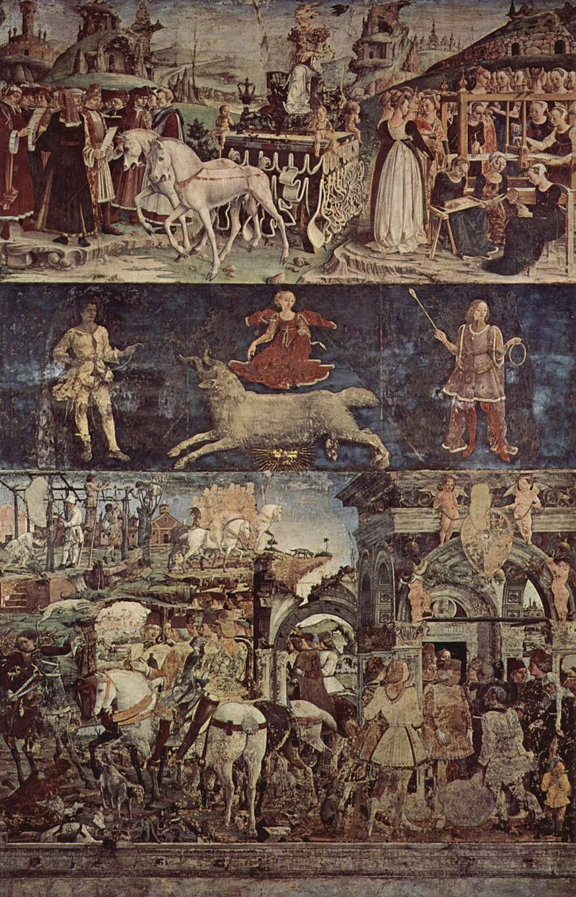

# Я как миллениал конечно не...

Я, как миллениал, конечно, не могу найти себе занятия лучше, чем искать в философии оправданий астрологии. Вот несколько моих находок. 
 
Я сильно надеялся на Аби Варбурга, но он слегка не оправдал ожиданий, особенно своим повторением что “астрология абсурдна”, столь частым, что задумываешься, что это может быть чем-то большим, чем просто тревогой, что серьезные люди не воспримут всерьез. Он говорит следующее: астрология была одним из важнейших путей, которыми греческие образы смогли дойти до Возрождения и далее; эти образы были, для Варбурга, главными способами материализовать основные проблемы греческой культуры. Другими словами, хотя арабская астрология (согласно Варбургу) редуцировала греческие экзистенциальные вопросы до случайного набора простых советов для жизни, иконическая сила этих образов - сила, достаточно мощная, чтобы эти образы пережили, в упрощенной но аутентичной форме, тысячелетнее путешествие до Индии и обратно - эта сила была источником возрожденческих открытий. Например, “оба изображения Венеры Ботичелли - Рождение Венеры и так называемая Весна - были попытками освободить богиню от ее двойных средневековых оков - мифографических и астрологических - и вернуть ей Олимпийскую свободу”, что было бы невозможно, если бы “оковы” не позволили сохранить ее образ так надолго в первую очередь. 
 
У Беньямина понятие “созвездия” сводится к тому, что созвездие - в первую очередь, способ заметить отдельные звезды. Действительно (Беньямин не разбирает астрологию, так что дальше - моё), хотя созвездия не “существуют”, они все же используются, чтобы адресовать звезды, в том числе “наукой”. В отличие от маленького мира на Земле, у которого есть естественная основа, у космоса нет объективной системы отсчета, никакого стабильного способа опосредовать визуальное поле. Поэтому система отсчета с центром у нас не хуже, чем любая другая, и имеет двойное достоинство в своей скромности, и в том, что дает непосредственный метод описания видимого неба. Для земных существ, гравитация - способ оставаться в безопасности привязанными к огромному великому камню, защищающему их от бесконечного, хаотического пространства; для космонавта, гравитация - способ организовывать вещи между собой в небольшие группы, давая каждой из них достаточно пространства и свободы, чтобы продолжать падать на что-то гораздо большее, чем они - и промахиваться в этом падении, вновь и вновь избегая поглощения. 
 
В другом месте, Беньямин намекает, что “будучи отличной от знаков, судьба позволяет говорить о себе лишь знаками”, что у судьбы нет собственного естественного языка. Грандиозный язык астрологии, достаточный для тысяч лет судеб более величественных, чем наши, не может быть хуже, чем редуктивное, неолиберальное крохоборство “эндорфинов”. Это особенно важно, поскольку для Беньямина, речь это единственный способ повлиять на наши судьбы - т.к. действия всегда предрешены. Наука согласится, что свобода может быть лишь феноменом языка. 
 
И моя любимая идея - из эссе Ника Ланда о хайдеггеровском эссе о Тракле. Он говорит, что в самом начале, небо и наши души выглядели одинаково хаотично, и, когда мы узнали в небе хаос нашей судьбы, это и создало саму возможность знания, науки и культурного мышления. Наша смелость в том, чтобы навязать субъективный, произвольный визуальный порядок на хаос неба - первый шаг к смелости в том, чтобы разобраться в наших душах. Сейчас, тысячу лет спустя, мы там же узнаем наш собственный внутренний хаос в хаосе нейронных сетей; у нас, конечно, нет ни капли той же смелости, чтобы навязать им наш собственный порядок.

    Date: 2020-02-23 18:05
    Likes: 36
    Comments: 0
    Reposts: 4
    Views: 2473
    Original URL: https://vk.com/wall-140963346_402

