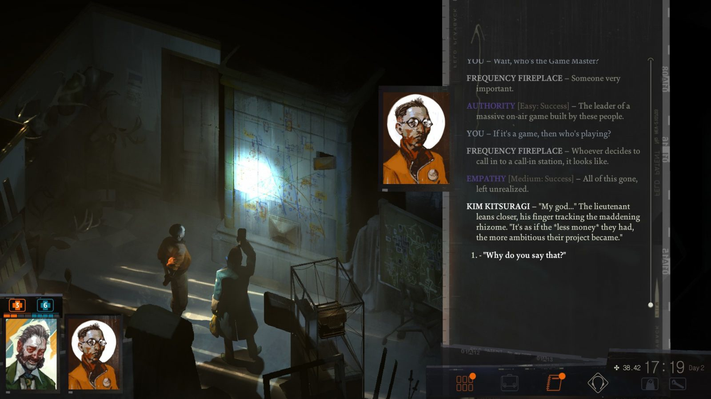

# Disco Elysium  игра про...

Disco Elysium - игра про внутренний мир. Огромный, невероятно хорошо написанный квест: я очень не люблю игры с текстом, но этой действительно зачитывался. Она вполне вписывается в жанр “истерического реализма” (Пинчон, ДеЛилло; Пелевин), литературы, направленной на изображении теории - всеобъемлющей, параноидальной, подтверждаемой логикой, формой и символами, идиосинкратичной и в то же время странно, таинственно адекватной; постоянно ссылающейся и комментирующей текущие и исторические события, обогащая их странной, параноидальной эмоциональностью (любой страстный текст о Трампе и русских шпионах - тоже истерический реализм). 
 
Квесты, как правило, изображают (с помощью больших, статических иллюстраций) уже умерший мир, застывший за два-три шага (за два-три повернутых рычага, две-три найденные подсказки) до своего окончательного раскрытия. В Disco Elysium мир застыл в результате проваленной революции: пролетариату не удалась новая попытка новый мир построить, и все окончательно остановилось. Главный герой просыпается в эпицентре конфликта, который вообще не развивается: конфликт между корпорацией и бастующими рабочими, в результате которого весь город стоит - на его улице пробка, машины в которой не двигались уже полгода. В отличие от многих других квестов, людей в Disco Elysium немало, но вместе с мировой историей они потеряли и возможность развивать свою. 
 
Кроме главного героя. “Революция это не то внутри нас, что мы должны совершить, она снаружи – и если мы совершаем ее внутри себя, то это лишь способ избежать совершения ее снаружи” (Делез) - в данном случае, революция снаружи провалилась, и все, что происходит, происходит у героя внутри. А происходить у него внутри может очень, очень много. Как и мы с вами в разгар карантина, протагонист-мент, будучи абсолютно не в состоянии расследовать преступление, занимается, в общем-то, исключительно саморазвитием. И развивать он может шестнадцать “скиллов” (вроде “болевого порога”, “драматичности” и “ноу-хау”), каждый из которых участвует в игре не столько в виде какого-то числа, но в виде все более и более часто и громко проявляющегося внутренного голоса, обогащающего диалоги - как внутренние, так и с другими персонажами. Помимо них, доступны и проявляются тем же образом несколько десятков параноидальных теорий, каждую из которых можно “интериоризировать”: например, теорию о том, что герой когда-то был суперзвездой, или о том, что существуют животные-аудиоволны - или, конечно, одну из многочисленных политических теорий, от коммунизма до радикальной расовой иерархии. Так, несмотря на то, что мир не меняется, герой может научиться давать самому себе к нему постоянный параноидально-теоретический комментарий, на свой собственный вкус; развитие этих внутренних голосов приводит к тому, что одни и те же пространства внутри игры начинают читаться в процессе совершенно по-разному. Внутренний мир - единственная форма развития и жизни после остановившей историю глобальной катастрофы.

    Date: 2020-03-25 18:17
    Likes: 84
    Comments: 11
    Reposts: 11
    Views: 3798
    Original URL: https://vk.com/wall-140963346_405

--------------------

  * Будет видеообзор и оценка по десятибалльной шкале?
    Author: Yaroslav Mikhaylov, Date: 2020-03-25 20:59, Likes: 1

  * Игра потрясающая, но после двух часов игры голова заболела. Сложноват там английский для такого русского быдла как я
    Author: Sanya Zmey, Date: 2020-03-27 09:50, Likes: 2

      * [id175206341|Sanya], понимаю) ходят мутные слухи, будет перевод к концу года
        Author: Valentin Golev, Date: 2020-03-27 13:26, Likes: 0

  * О, да, при игре сразу вспомнился Пелевин. 
    Очень нравится тамошний worldbuilding, он шикарно вписан в сюжет. Очень интересно было постепенно раскрывать для себя детали этого мира. И пояснять NPC за рыночек, хе. 
    Английский, правда, такой, что я со своим С2 не выдержала и ко второму часу достала словарь. Всё ещё проще, чем настоящая художка, но тем не менее.
    Author: Taisia Sharapova, Date: 2020-03-28 14:53, Likes: 4

      * [id163738403|Таисия], ого, пояснять за рыночек в игре, сделанной коммунистами - занятие смелое. И чем дело кончилось?
        Author: Alexander Maldon, Date: 2020-08-19 10:05, Likes: 1

      * К сожалению, пока так и не прошла до конца. Но из того, что видела, все три радикальные позиции — и комми, и фаш, и чистый капитализм — достаточно гипертрофированы и в игре скорее для юмора, чем серьёзно. То есть да, к  чести разрабов, свою позицию они тоже простебали.
        Author: Taisia Sharapova, Date: 2020-08-19 14:06, Likes: 1

      * [id163738403|Таисия], плюс центризм ещё. Вот эта отсылка на Евросоюз, забыл, как она в игре зовётся, но к ней принадлежит воскресный друг в апартаментах, где свидетель линчевания курит.
        Author: Alexander Maldon, Date: 2020-08-19 14:09, Likes: 2

      * Ещё женщина на яхте тоже радикальный центрист, если мне память не изменяет. В общем, репрезентация есть. 
        У меня создалось впечатление, что они скорее лорные, чем пародийные.
        Author: Taisia Sharapova, Date: 2020-08-19 14:12, Likes: 2

      * [id163738403|Таисия], Джойс, насколько я помню, из ультра-либералов (корпорация Дикие Сосны-то), просто она решила не действовать радикально и не воевать с Союзом за порт. А касательно воскресного друга... Ну он мне показался вполне пародийным. Он всё время крайне формальным и канцелярским языком рассказывает о деятельности своего правительства, а когда ему задаёшь прямые вопросы - уходит от ответов.
        Author: Alexander Maldon, Date: 2020-08-19 14:16, Likes: 2

      * Справедливо.
        Author: Taisia Sharapova, Date: 2020-08-19 14:16, Likes: 2

      * да, они там все – обобщенные персонажи онлайн-дискурса политического американского (собственно, озвучка от чапо треп хауса туда же...), а не настоящие политические позиции
        Author: Valentin Golev, Date: 2020-08-20 02:02, Likes: 0

