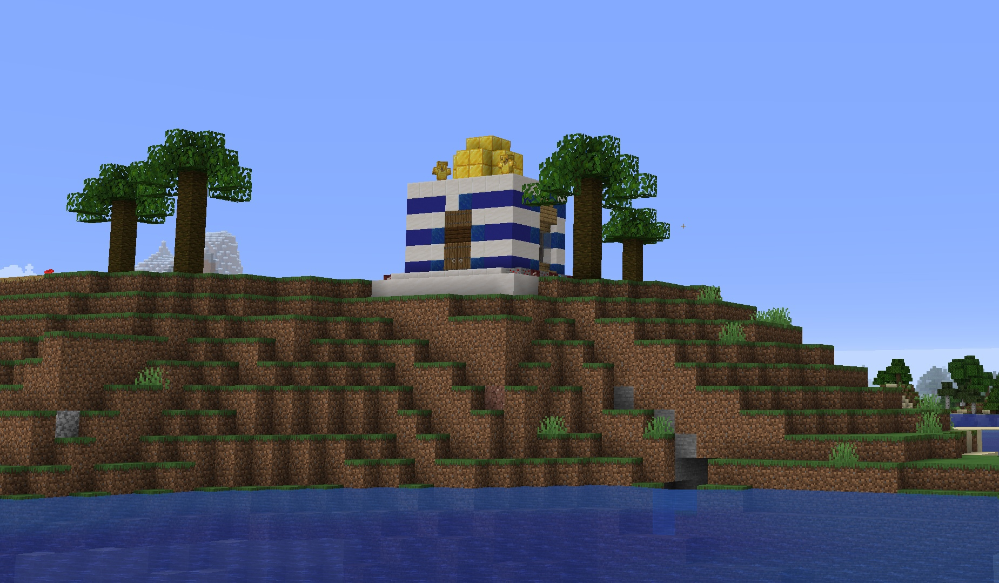

# Возможно гвоздь микроскопом но вот...

Возможно, гвоздь микроскопом, но вот это Делезовское разделение «откровения» и «выражения» точно и с нужным мне пафосом выделяет то, что мне так не нравится во многих играх на важные мне темы, и в критике игр с важных мне позиций. Например, вот Zachtronics сделала в прошлом году отвратительную игру про алхимию и программирование, две практики, связь которых мне кажется совершенно драгоценной идеей, позволяющей мистицизму выживать и перерождаться в современности в такой форме, которая находит путь в самое сердце (нео-)рационалистов, абсолютно о магичности своего мышления не подозревающих. Вот, и эти люди умудрились сделать игру об этих практиках так, чтобы проигнорировать самое важное и таинственное, что между ними происходит – то, как слова рецепта/алгоритма сначала связывают между собою мифологическое, этическое, идеологическое, практическое и техническое (в алхимии и в программировании оно все проявляется по-разному, но сходится в любом случае на уровне конкретного слова, которое имеет разное значение в разных контекстах), а потом навязывают это переопределенное значение миру обратно. Ну типа, друг как феномен американской культуры => друг как запись в бд фейсбука => друг как ресурс социальной сети как бизнеса => друг как «френд на фейсбуке». Зактроникс всю эту магию теряет, и оставляет и алхимию, и программирование, в рамках какого-то идиотского головоломного крючкотворства, показывает их исключительно как «знак», говоря по-философски, то есть как какой-то намек на какое-то не очень важное их свойство (а именно, что типа есть какая-то «последовательность команд», что в общем-то даже не совсем уж обязательно ни в программировании, ни в алхимии). У Делеза (Спинозы) «знак» это когда какое-то не очень важное свойство чего-то зачем-то предлагается как некое «откровение» о предмете, обычно в целях к чему-нибудь людей принудить. «Ооо, и там и там последовательность команд, вот займитесь ими».

Или вот наоборот, Minecraft с какой-то безумной точностью выразила ресурсных подход к миру, причем вот Делезовское понимание «выражения» подходит здесь очень хорошо. Minecraft не просто типа показала, как иногда можно к чему-то немножко относиться как к ресурсу, а предлагает некоторый бесконечный способ кодировать абсолютно что угодно в мире (железо, воду, кровать, печку, пчелу) как кубик, который можно «добывать». Это действительно «выражение», а не просто знак, именно за счет совпадения этих двух потенциальных-формальных бесконечностей: безгранично применимой формы капиталистического мира, который все вокруг в ресурс превращает, и такой безгранично применимой формы майнкрафтовских кубиков, которые могут и будут все в мире кодировать. Ну и находятся критики, мол, майнкрафт плохо, не надо нам капиталистический мир из кубиков, надо игру, где все конфеты бесплатно едят – они хотят не игры, выражающие этот мир, а игры которые «откровение» о том, как нам надо жить и думать. Но критиков проще игнорировать, чем отвратительных гейм-девелоперов, мне просто не так обидно. То же про Factorio и автоматизацию, совершенно грандиозная игра-«выражение». Сто лет книг не читал, вот почитал, узнаю новые слова, как видите, всегда полезно. Знаю теперь, что самое главное это безграничная применимость найденной формы, если она есть, то и вот и выражение, потому что у меня обычно одни откровения. В русском переводе страница 41, очень интересно.

    Date: 2020-08-19 05:38
    Likes: 55
    Comments: 12
    Reposts: 6
    Views: 2648
    Original URL: https://vk.com/wall-140963346_416

--------------------

  * Под игрой от зактроникс подразумевается molek-syntez?
    Author: Max Klinskikh, Date: 2020-08-19 05:46, Likes: 1

      * Скорее всего Opus Magnum, там именно алхимия.
        Author: Alexey Morozov, Date: 2020-08-19 08:29, Likes: 3

      * Вот только он вышел, в отличие от Молека, в 2017-м, так что «в прошлом году» звучит странно.
        Author: Taisia Sharapova, Date: 2020-08-19 15:19, Likes: 1

      * пардон) все верно. время для меня остановилось
        Author: Valentin Golev, Date: 2020-08-20 01:59, Likes: 0

  * Лекции о Спинозе?
    Author: Sonya Erixson, Date: 2020-08-19 15:19, Likes: 1

      * [id201738183|Sonya], блин я был уверен, что написал. «Спиноза и проблема выражения»
        Author: Valentin Golev, Date: 2020-08-20 01:59, Likes: 1

  * Вот думала ещё вчера тебе написать в тг: на сто процентов согласна) веду заметки тоже о том, что Майнкрафт -  идеальное выражение мысли ДГ. или вела, а теперь у меня уже просто майнкрафто-мания 😜
    Author: Lika Kareva, Date: 2020-08-20 10:59, Likes: 1

      * [id30471219|Lika], до сих пор?)) можем вместе погонять как-нибудь
        Author: Valentin Golev, Date: 2020-08-20 11:43, Likes: 0

      * да я только недавно начала!) игнорила его до прошлого года
        Author: Lika Kareva, Date: 2020-08-20 11:45, Likes: 0

      * давай погоняем, я с радостью) можно на следующей неделе
        Author: Lika Kareva, Date: 2020-08-20 11:48, Likes: 1

  * Какое интересное здание на пикче. Так вот, где Хиробрин похищенных детишек-майнкрафтеров держит.
    Author: Egor Kirisamov, Date: 2020-08-21 00:02, Likes: 2

  * слушай, а ты куртова про техно-теократию читал? если алхимию с програмированием удалось геймдевелопам смешать хреново, то руские фейлософы ещё могут порадовать
    Author: Stepan Labadzinsky, Date: 2020-08-29 22:17, Likes: 0

