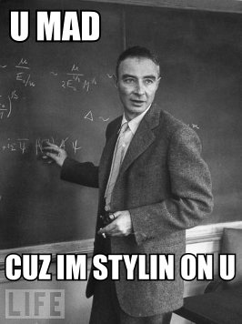

# На мой предыдущий пост набежали...

На мой предыдущий пост набежали умные люди и объяснили мне, что я в своей необразованности не понимаю, насколько много в космосе удивительного, и как круто было бы нам всем туда улететь. Что было очень приятно и немного неожиданно, потому что я даже как будто бы и забыл про существование умных людей. Конечно, это не моя первая встреча с ними – даже в детстве я иногда оказывался среди таких, на какой-нибудь, скажем, математической олимпиаде, и обязательно задавал им вопрос, который меня интересовал больше всего: а что они собираются с этим своим умом потом делать? Редко я получал внятный ответ, хотя и улавливал некий вайб, хотя вот однажды я услышал его выражение довольно прямо от одного из моих товарищей по математической школе: «я буду работать программистом в банке» (ему было, к слову, 14, а не 35). И вот прошли годы, и так и оказалось – самые умные люди в мире пишут xml-парсеры в Гугле, предсказывают цены на нефть в Газпроме, а иногда даже занимаются теоретической физикой, либо пишут очень сложные статьи о, скажем, теории суперструн (которые потом фанаты умных людей очень смешно интерпретируют для газет типа Aeon), либо, наоборот, еще более сложные о том, что, скажем, теория суперструн это не наука вообще. I saw the best minds of my generation... optimising ads for Facebook... and hysterically defending science in my comments section. Больше, чем зарабатывать деньги для других людей и придумывать новые виды оружия, умные люди любят только защищать Ум как ценность и измерять свой IQ.

Короче, мое еще детское подозрение о том, что Ум достиг плато своей стабильно убывающей полезности, и что человеческий Ум все более и более исключен из процессов принятия решений в нашем мире, из направления развития нашей истории, сейчас подтверждается очень наглядно. Даже сами умные люди признают это, в виде этих непрекращающихся, отчаянных жалоб на то, что их умные, рациональные, научно доказанные советы никто не слушает. Ну и то, что современные философы пишут книги об Уме как об абстрактной, универсальной ценности, должен был бы намекнуть на то, что Ум это красивый нож, которым уже особенно нечего резать. Изменение роли Ума в мире сменилось очень быстро – еще как будто бы вчера гениальные изобретатели атомных бомб основательно занимались гуманистической политикой, а великие шахматисты уверенно строили демократии. И все же закон убывающей полезности так и работает: «с ростом потребления блага... общая полезность, получаемая потребителем, возрастает, но скорость роста замедляется», пока не доходит до нуля, а то и уходит в минус, то есть в уменьшение общей полезности. Вряд ли этот закон был бы неожиданным в наш век disruption, в котором большие корпорации, расслабившись и полагаясь на свои богатства и знания, постоянно, но все же неожиданно для самих себя обнаруживают, что не способны уже развиваться и медленно разлагаются, обираемые проворными стартапами, да и целые страны, привыкшие полагаться только на свои природные ресурсы, перестают экономически развиваться и медленно и очень болезненно сгинают в небытие. Так и Ум, а точнее, декартовская концепция Ума достигла своего пика, из нее немало выжали полезного, но время ее власти ушло, Ума, конечно, на личном уровне еще долго будет достаточно для более-менее сытой жизни, но с исторической точки зрения он больше не в центре внимания. Относитесь к культу Ума как и к другим родительским советам, которые работали для них и работали тысячи лет перед ними, но вряд ли адекватны для нас: Ум это такая же очаровательная, интересная, но все же немножко устаревшая ценность, как и ранняя свадьба, приплод в 20 лет, хороший диплом, агрессивная маскулинность. Короче, это было маленькое идеологическое замечание, а в следующем посте – историческая перспектива, его поясняющая.

    Date: 2021-04-22 14:40
    Likes: 52
    Comments: 17
    Reposts: 14
    Views: 1155
    Original URL: https://vk.com/wall-140963346_535

--------------------

  * Смысловую нагрузку этого поста можно уместить в одну строчку: "Есть умные люди, но интеллект больше не важен..."
    
    Сразу возникает вопрос: а что по мнению автора важно?
    Писать многозначительные посты без предмета рассуждения и вывода?
    
    Здесь нет никакой чётко выраженной позиции, только линия ускользания сначала от космоса к личностям, от личностей к применению IQ, от IQ к понятию Ума в широком смысле.
    
    - Вы неправы насчёт космоса, потому что "утверждение А".
    
    - Да, конечно, а вот вы знаете, что умные люди бла-бла-бла... (и так далее)?
    
    Очень похоже на неумение вести честную дискуссию и отказываться от ней при нежелании вести диалог.
    Ещё напоминает попытку нанести оскорбление:
    
    - Да, вы меня слили, но вас мама не любит, хи-хи-хи-хи!
    
    При этом позитивного смысла нет даже здесь - нет уточнений, кто маме по нраву.
    
    Детский садик, отписка.
    Author: Artur Lapinov, Date: 2021-04-22 16:03, Likes: 9

      * [id448022449|Артур], а зачем писать не-ученому (человеку не связанным с институтами) посты с каким-то выводом? Чтобы положить вам в рот полуфабрикат мысли?
        
        Это авторский блог, где автор пишет то, что он хочет писать. Вы из этого текста можете что-то выуживать, а можете этого не делать.
        
        Автор не должен соответствовать вашим ожиданиям, просто потому что. А почему он должен писать посты с выводом и в каких-то рамках? Потому что это где-то принято? А где это принято?
        
        Ваши попытки уколоть Валентина настолько же детские, как и то, что вы приписываете ему в качестве какой-то проблемы.
        Author: Dima Motorov, Date: 2021-04-22 16:15, Likes: 7

      * Посты следует писать с очевидной целью - распространять свои идеи.
        К несчастью у админа группы их нет, чему я глубоко соболезную.
        И это вовсе не оскорбление, а факт: ни здесь, ни в каком другом посте позитивного смысла не предлагается, ни в полуфабрикатном, ни в перемолотом миксером виде.
        
        Конечно нет, разумеется это не значит, что автор обязан соответствовать чьим-то ожиданиям, однако читатель тоже не обязан читать его бессмысленное, бесполезное, некрасивое эстетически ГОВНО.
        
        Собственно, я не буду, и вам тоже не рекомендую. 
        Всего хорошего 👋🏻
        Author: Artur Lapinov, Date: 2021-04-22 16:28, Likes: 1

      * Теперь проветривать паблик придётся весь день..
        Author: Amelia Stark, Date: 2021-04-23 10:23, Likes: 0

  * Ну попробуй, пооптимизируй рекламу для фб или напиши XML парсер или попредсказывай курсы нефти расскажешь потом, как пригодился ум или нет)
    Author: Lyosha Anikeev, Date: 2021-04-22 16:12, Likes: 3

  * Классическая драма.
    Псевдоинтеллектуал жалуется на интеллектуалов и их "занудность", недосягаемую его восприятию .
    .
    .
    .
    .
    .
    .
    .
    .
    .
    .
    P.S.:
    Если обладая умом, дальнейшее будущее тебе стало не интересно - значит ты уже мертв.
    Author: Alexander Tverskoy, Date: 2021-04-22 16:57, Likes: 2

  * ну если нефть и реклама на фб не решают проблему смысла, то вот космос может в какой-то перспективе, но лучше всех боженька, туда и надо ум этот (возвращать?), будет где полезности ещё разгуляться 😇
    Author: Kolya Katuninx, Date: 2021-04-22 18:02, Likes: 1

  * Мэн, смотрю на комменты и нахожу подтверждение тому, насколько тонкую интуицию ты схватил. Я закончил ИТМО в 2016, и уже тогда из академии с фундаментальным образованием он начал превращаться в институт для стартаперов. С тех пор я начал искать область, которая была бы шагом вперед по отношению к крысиным бегам картезианского когито. Сейчас вангую атлетизм бессознательного следующим трендом по теме.
    Author: Alexey Tkachev, Date: 2021-04-22 22:11, Likes: 3

      * [id5240663|Алексей],сначала  прочитала не стартаперы, а старпёры
        Author: Amelia Stark, Date: 2021-04-23 10:36, Likes: 0

  * осторожно, ожидается наплыв оскорблённых умных людей
    Author: Emil Biserov, Date: 2021-04-23 07:33, Likes: 0

  * Оскорбил чувства верующих 😆
    Author: Mikhail Larin, Date: 2021-04-23 09:48, Likes: 0

  * Уважаемая публика в комментариях внезапно обнаружила, что аксиологический кризис имеет отношение и к их боженьке. Что дальше? Обида на постмодерн? Спор о том, что является наукой, а что нет? Аргументы в духе "рыночек порешал"?
    Author: Amelia Stark, Date: 2021-04-23 10:29, Likes: 1

  * Попробую поразмышлять в таком ключе...
    
    1. О космосе. Безусловно часть технических, да и не только, специалистов заворожена достижениями науки за последний век-два. И есть чем быть завороженным. За короткое время Нового времени мы сделали резкий скачок в области технического знания и эта сфера продолжает развиваться в геометрической прогрессии. 
    
    Итак. Пускай сейчас большая часть программистов занята настройкой таргетированной рекламы и остальными тривиальными мелочами, но во первых - кто сказал, что программисты в виде исполнителей технических задач торговли - это фронтир науки или единственный представитель Ума, оплакиеваемого автором. За пределами прикладного программирования трудятся еще несколько наук и не только технических, и каждая из них может принести открытия, способные перевернуть аксиологическию картину мира (возьмем хотя бы исследования продления жизни, рекреации). И здесь стоит разделять академические исследования и наемный труд технаря за зарплату. И во вторых, что самое главное, что именно здесь смущает автора? Разве даже часть рекламного бизнеса это не есть то самое обустройство нынешней ойкумены от которой нас якобы отвлекает космический миф во главе с Маском? Если это смущает Валентина, то упоминаемые им картезианские умы, уважаемые умы трудились для того, чтобы просто снести пол-планеты. Жуткая получается коллизия картезианского знания!... и если это эталон, то не лучше ли присмотреться критически к этому эталону. Даже в академической жизни есть доля рутинных практик, которые могут ничего не принести. можно собрать город из ученых, которые исследовали тупиковые области знания и чья жизнь внешне оказалась провалом. Но следующие поколения будут всегда им благодарны за исследования тупиковых троп (зловеще). Они проделали этот путь, чтобы сказать, что там ничего нет... 
    
    Кроме того, не будем все-таки принимать нынешний уровень образования за данность. Очевидно, что всеобщее правописание и в Европе то получило распространение только к середине 20-го века (посмотреть хотя бы на историю Португалии). Мы только век как научились читать и писать - и то не везде! - а уже оплакиваем интеллект? Возможно разгадка в том, что мы переоцениваем важность программирования и через сто лет эта профессия будет сродни автомеханику сто лет назад (в некоторых областях это уже так, посмотрим на фронтенд разработку). Так или иначе боль рядового программиста, заскучавшего над настройкой рекламы, трудно выдавать за боль всего интеллекта мира.
    
    2. Аксиология... Понятны чувства автора. И по моему скромному мнению, лучше всего на русском языке они описан в "Исповеди" Толстого. Замени там литературу и искусство на программирование и физику и получиться лучшая версия поста уважаемого автора. Не буду углубляться, но да, конечно технический прогресс во всей своей красе - вещь условная и плоды приносимые им тоже. Это же распространяется на области искусства, да и культуры, которая есть точно такая же ракета запущенная в космос необъятного мира. Культура, в которой мы придумываем себе богов, чтобы согреться во мраке хаоса. Так что не будем ругать ракеты) эти наши маленькие игрушки, соразмерные той скуке, которую мы нажили за нашу скромную историю.
    
    3. Интеллект и его влияние на историю... Валентин сетует, что интеллектуалы не созидают историю, не созидают будущее, но когда это черт возьми было в нашей истории? Примеров царей-философов не так много, а вот на антипримерах построена вся политика). Примеры политических опытов Платона и Пифагора говорят сами за себя. Вольтер (политический в сущности мыслитель) был на десятых ролях в роли придворного публициста. Может Маркс... но фигура далеко не самостоятельная. Так вот. Любой интеллектуал должен (по моему скромному мнению) понять наконец-то, что историей и судьбой человечества управляют политики(в широком смысле этого слова), именно те люди, которые реально находятся у власти. И пользуются они плодами интеллектуальной деятельности, в своих корыстных политических целях. Макиавелли тут все давно объяснил. Интеллектуала всегда преследует искушение властью, но либо он слишком малодушен, чтобы вступить политическую борьбу, либо вступив в нее, неизбежно теряет объективность и вместе с тем чистоту ума. Это как врожденная кастовость, действительно присущая обществу.
    
    Ум это действительно инструмент. И автор прав, что примат и пафос ума в обществе может ослабевать, но это как мытье рук, которым уже никого не удивишь, а век назад, чтобы убедить человека купить мыло, нужно было прибегнуть к той же самой рекламе (советую посмотреть историю рекламы мыла). Но правы, как мне кажется и оппоненты Валентина, обличающие его крипторелигиозность)) ибо мир, познаваемый как формальная система, не может (согласно теореме Геделя о неполноте) быть объяснен сам из себя. И как сказал один мудрец: религия - пайка доступная всем, и умным и глупым. Тот самый опиум, обезбол человечества. Заглушка в программе мира) 
    
    Итак. Воздадим же почтение всем богам. Славься Урания. Славься Клио. Славься Полигимния. Славься Калиопа.
    
    П.С. Валентин, хотел бы посоветовать вам книгу Секацкого, если вы вдруг ее не читали. Называется "Последний виток прогресса". Книга как раз таки разбирает описываемые вами интуиции. Там много ответов о том, почему обесценивается значение интеллекта в мире... и о том, что нам делать дальше... Спасибо за статью.
    Author: Maxim Antonov, Date: 2021-04-23 16:32, Likes: 0

  * 
    Author: David Petrosyan, Date: 2021-04-23 16:33, Likes: 2

  * 
    Author: Igor Lufanin, Date: 2021-04-24 12:55, Likes: 0

  * Но это же хорошо развитая тема, если я верно понял идею. Есть отл книжка How Reason Almost Lost Its Mind: The Strange Career of Cold War Rationality
    Author: W-S Surlaw, Date: 2021-04-25 13:49, Likes: 0

  * В какую эпоху аристотелианская места о "Государстве философов" была реализована более, чем сегодня? Ну, да, рацио по прежнему находится на побирушках у либидо и прочего эмоционального, но откуда этот пафос изменения его значимости в меньшую сторону? Сегодняшние схемы принятия масштабных решений хотя бы обязаны иметь претензию на интеллектуальность, чтобы быть публично значимыми. Век назад и далее "умные люди" имели еще меньше перспектив.
    Author: Akkaunt Udalen, Date: 2021-04-26 01:25, Likes: 2

